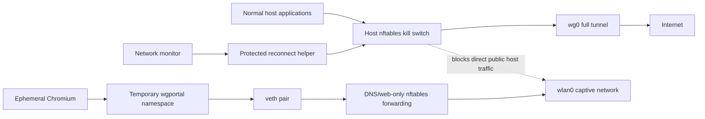

# wireguard-reconnect

WireGuard controls and optional recovery automation for a Linux laptop using
iwd/systemd-networkd, with Waybar integration, an opt-out full-tunnel kill
switch, opt-out reconnect/boot/portal automation, and opt-in Tailscale repair.

Current release: **v1.3.0-beta.1**

> **Public beta:** this is an opinionated security integration for a tested
> systemd/Wayland laptop stack, not a distribution-neutral VPN manager. Read the
> support matrix and recovery instructions before installing it on another
> machine.

Licensed under **GPL-3.0-or-later**.

## Behavior

The default install enables the complete fail-closed experience below for
backward compatibility. The kill switch, automatic reconnect, boot connection,
captive-portal support, automatic portal detection, and immediate installer
connection are independently selectable; see [Install](#install).

- **Before normal networking at boot:** pre-arms a fail-closed nftables guard
  using a root-only cached WireGuard endpoint.
- **On every system boot:** marks `wg0` as intended-on and connects it as soon as
  a physical default route is available.
- **After suspend/resume:** restarts the network monitor, waits for Wi-Fi, tests
  real traffic through `wg0`, and reconnects only when stale.
- **After Wi-Fi/AP/network changes:** reacts to netlink route/link/address events
  instead of waiting for Waybar's polling threshold.
- **After an intentional disconnect:** leaves WireGuard off for the rest of that
  boot. The next system boot enables it again by default.
- **With opt-in Tailscale integration:** preserves pre-existing table-52 rules
  and adds a tracked, removable priority rule only when needed to keep active
  tailnet routes ahead of WireGuard, without starting or reconfiguring Tailscale.
- **With the kill switch:** caches the WireGuard endpoint so reconnect can
  bootstrap without leaking general traffic over the physical interface.
- **Fail-closed reconnects:** the nftables guard is armed and verified before
  `wg0` is brought up, remains active while `wg0` is bounced, and is verified
  again afterward. A failed verification takes `wg0` down and leaves public
  traffic blocked.
- **Automatic captive portals without host leaks:** after a Wi-Fi/AP/network
  event, a failed protected reconnect automatically starts detection from a
  dedicated network namespace. Only when independent probes indicate a portal
  does it open an ephemeral Chromium profile inside that namespace and allow its
  DNS/web traffic over the Wi-Fi underlay. Every normal host process remains
  blocked by the kill switch. After login returns the expected HTTP 204s, the
  namespace is destroyed and WireGuard is restored and verified automatically.

## Architecture



The portal browser receives a separate network stack, routes, and interfaces,
but not a separate filesystem or kernel. Namespace cleanup is verified before
normal VPN actions resume.

## Tested support matrix

| Component | Tested/supported | Notes |
|---|---|---|
| Init/service manager | systemd | Required by installer and sleep hook |
| Firewall | nftables | iptables-only systems are not supported |
| WireGuard | `wg-quick`, full-tunnel `wg0` | Interface may be overridden |
| Wi-Fi/network stack | IPv4 underlay with iwd + systemd-networkd | Other netlink-compatible stacks and IPv6-only underlays are untested |
| Desktop | Wayland + Waybar | CLI controls work without Waybar; automatic browser launch requires an active local Wayland session |
| Browser | Chromium, Brave, or Google Chrome | Required only when captive-portal support is enabled; Firefox is not currently supported by portal isolation |
| Distribution | Arch Linux / Omarchy | Other systemd distributions require dependency/path validation |
| Tailscale | Optional, explicit opt-in | Existing rules are preserved; a tracked rule is added only when required |

Core commands include `systemctl`, `ip`, `wg`, `wg-quick`, `curl`, `flock`,
`nft`, and `pkexec`. Captive-portal support additionally requires `loginctl`,
`iw`, `runuser`, `resolvectl`, `sysctl`, `setsid`, and a supported browser.

## Files

- `wireguard-reconnect` — root-owned, fixed-action helper used through `pkexec`
- `wireguard-portal` — isolated captive-portal namespace/browser orchestrator
- `wg-killswitch` — nftables full-tunnel kill switch
- `wireguard-status` — Waybar JSON status/toggle/autoreconnect command
- `wireguard-monitor` — event-driven physical-network monitor
- `wireguard-autostart` — enables WireGuard by default on each boot
- `wireguard-reconnect-sleep` — restarts the monitor after resume
- `wireguard-monitor.service` — persistent network monitor
- `wireguard-autostart.service` — boot-time default-on policy
- `wireguard-killswitch.service` — early-boot fail-closed nftables guard

## Operator documentation

- [Installer and rollback model](docs/installer.md)
- [Tailscale integration and bypass scope](docs/tailscale.md)
- [Captive-portal workflow](docs/captive-portals.md)
- [Testing, diagnostics, and maintenance](docs/testing.md)

## Install

> Installing changes root-owned nftables policy and can intentionally block
> public traffic when WireGuard cannot be verified. Keep a local root terminal
> available for the first installation, review `make reset`, and do not install
> remotely unless you have an independent recovery path.

Confirm that `/etc/wireguard/wg0.conf` already works with `wg-quick` and includes
`PersistentKeepalive = 25` for roaming laptops. Then run from this repository:

```bash
sudo ./install.sh
```

Install-time options are explicit and root-persisted. All feature flags accept
`0` or `1`; omitted flags use these defaults on first install and retain their
recorded value on later upgrades:

| Option | Default |
|---|---:|
| `ENABLE_KILLSWITCH` | `1` |
| `ENABLE_AUTOMATIC_RECONNECT` | `1` |
| `ENABLE_AUTOSTART` | `1` |
| `ENABLE_CAPTIVE_PORTAL` | `1` |
| `ENABLE_AUTO_PORTAL` | `1` |
| `CONNECT_ON_INSTALL` | `1` |
| `ENABLE_TAILSCALE_INTEGRATION` | `0` |

For example, install controls only and leave WireGuard entirely manual:

```bash
sudo ENABLE_KILLSWITCH=0 \
  ENABLE_AUTOMATIC_RECONNECT=0 \
  ENABLE_AUTOSTART=0 \
  ENABLE_CAPTIVE_PORTAL=0 \
  CONNECT_ON_INSTALL=0 \
  ./install.sh
```

Or keep fail-closed manual operation without automatic reconnect, boot connect,
or portal detection:

```bash
sudo ENABLE_AUTOMATIC_RECONNECT=0 \
  ENABLE_AUTOSTART=0 \
  ENABLE_AUTO_PORTAL=0 \
  CONNECT_ON_INSTALL=0 \
  ./install.sh
```

The default authorized interface is `wg0`; use `INSTALL_INTERFACE=wg1` to
change it. The passwordless helper rejects other `wgN` profiles. Captive-portal
handling requires the kill switch, so opting out of the guard also disables the
portal feature. Tailscale integration is disabled by default and never runs
`tailscale up`. See the [installer option matrix](docs/installer.md#preconditions-and-options)
for dependency behavior, safety implications, and reconfiguration.

Detailed operator documentation:

- [Installer and rollback model](docs/installer.md)
- [Tailscale integration and bypass scope](docs/tailscale.md)

The installer serializes portal/reconnect actions and applies only the selected
components. With default options it pre-arms the guard, performs protected
interface migration, and verifies real WireGuard traffic. Every configuration
retains transactional restoration of prior interface, guard, files, services,
and tracked policy rules on failure.
Backups are written under `/var/backups/wireguard-reconnect-*` with mode `0700`.

### Uninstall

Uninstalling intentionally disconnects WireGuard and removes the kill switch
before deleting helpers and services. WireGuard configuration and installer
backups are left untouched. A specific backup is restored only when explicitly
requested with `RESTORE_BACKUP_DIR=/var/backups/wireguard-reconnect-...`:

```bash
make uninstall
# or: sudo ./uninstall.sh
```

Uninstall refuses to proceed while portal cleanup is active or if it cannot
safely remove the fail-closed guard.

The Waybar module should execute `wireguard-status` and bind only middle-click
to `wireguard-status toggle`. Leaving left- and right-click unbound prevents an
accidental connect or disconnect:

## Make commands

Run `make` or `make help` in this repository to list the available controls.
The common commands mirror the Waybar icon and provide an explicit recovery
path:

```jsonc
"custom/wireguard": {
  "exec": "wireguard-status",
  "return-type": "json",
  "interval": 10,
  "signal": 10,
  "on-click-middle": "wireguard-status toggle"
}
```

```bash
make status       # show the icon's current state
make toggle       # same as middle-clicking the icon
make disconnect   # explicit intentional disconnect
make connect      # explicitly connect wg0
make reconnect    # explicitly bounce and reconnect wg0
make reset        # EMERGENCY full bypass; disables leak protection
```

### Captive portals

Automatic portal handling is Wi-Fi-only, active-session restricted, rate
limited, and requires two concrete portal-like probes. It opens only an
ephemeral Chromium-family browser inside the `wgportal` network namespace;
ordinary host applications remain behind the kill switch.

```bash
make portal
make portal DOMAIN=wifi.example.com
make portal-simulate
make portal-container-simulate
```

Network/session changes, cancellation, timeout, cleanup failure, and reconnect
failure all return fail-closed. See the complete
[captive-portal workflow](docs/captive-portals.md).

Troubleshooting and maintenance commands are also available:

```bash
make diagnostics
make logs
make test
make install      # sudo install/update of the system integration
make uninstall    # safe removal; preserves WireGuard configs/backups
```

`make reset` remains an emergency full bypass for repairing a broken ruleset.
It is not used by captive-portal mode and intentionally removes leak protection;
prefer `make portal` whenever the network requires browser authentication.

Check the installed version with:

```bash
wireguard-reconnect --version
```

## Versioning and releases

The project follows [Semantic Versioning](https://semver.org/):

- **MAJOR** for incompatible behavior or installation changes
- **MINOR** for backward-compatible features
- **PATCH** for backward-compatible fixes

`VERSION` is the source of truth for the current release. Release commits are
tagged as `vMAJOR.MINOR.PATCH`, and notable changes are recorded in
[`CHANGELOG.md`](CHANGELOG.md).

Release checklist:

1. update `VERSION`;
2. move release notes into `CHANGELOG.md` with the release date;
3. update the current release shown in this README;
4. run the test and static-validation commands;
5. commit, create an annotated release tag, and push the commit and tag to both
   GitHub and FGit;
6. publish matching GitHub release notes; and
7. verify the public CI workflow.

## Configuration overrides

Environment variables may be supplied through systemd service drop-ins:

The authorized interface, feature policy, and Tailscale integration are persisted
install-time settings; re-run the installer to change them. Runtime service drop-ins may adjust:

- `WIREGUARD_MONITOR_DEBOUNCE=5`
- `WIREGUARD_MONITOR_STABILIZE_DELAY=2`
- `WIREGUARD_AUTO_PORTAL=1`
- `WIREGUARD_PORTAL_COOLDOWN=300`
- `WIREGUARD_PORTAL_GLOBAL_COOLDOWN=30`
- `WIREGUARD_PORTAL_SCAN_INTERVAL=60`
- `WIREGUARD_PORTAL_USER_FILE=/etc/wireguard-reconnect/portal-user`
- `WIREGUARD_STARTUP_WAIT=30`
- `WIREGUARD_CHECK_URL=http://connectivitycheck.gstatic.com/generate_204`
- `WIREGUARD_CHECK_TIMEOUT=4`
- `WG_KILLSWITCH_LOG_MAX_BYTES=262144`
- `WG_KILLSWITCH_LOG_KEEP_LINES=1000`
- `WIREGUARD_PORTAL_CHECK_URL_PRIMARY=http://connectivitycheck.gstatic.com/generate_204`
- `WIREGUARD_PORTAL_CHECK_URL_SECONDARY=http://cp.cloudflare.com/generate_204`

## Performance, diagnostics, and tests

The local nftables watchdog runs every 15 seconds; external portal/recovery
checks are separately serialized and run at most every 60 seconds. Netlink
events remain immediate.

```bash
make support-info  # reduced, shareable summary
make logs          # raw logs; redact before sharing
make diagnostics   # addresses/routes/rules; redact before sharing
make test
```

See [Testing and maintenance](docs/testing.md) for test layers, CI guarantees,
log rotation, probe privacy, and maintainability boundaries.

## Kill-switch exceptions

When enabled, public IPv4 and IPv6 egress is rejected unless it uses `wg0`.
Explicit host exceptions are limited to loopback, LAN/private destinations,
DHCP, the configured WireGuard UDP endpoint, Tailscale's marked encrypted
underlay, `tailscale0`, and local Docker/bridge interfaces. During captive-portal
mode, forwarded traffic from the root-created `wgportal0` veth is additionally
limited to DNS and web ports; all other traffic from that namespace is rejected
before the normal private/LAN forwarding exception. An intentional emergency
**disconnect/reset** still removes the guard completely; the next system boot
restores it only when the installed kill-switch policy remains enabled. Because LAN/private, Tailscale, DHCP,
and local bridge exceptions are intentional, the kill switch is not isolation
from hostile devices or proxies reachable through those permitted local paths.

## Security and contributing

Read [`SECURITY.md`](SECURITY.md) before reporting a suspected leak or privilege
boundary issue. General contributions follow [`CONTRIBUTING.md`](CONTRIBUTING.md)
and the [`CODE_OF_CONDUCT.md`](CODE_OF_CONDUCT.md).

## License

Copyright contributors to wireguard-reconnect.

This project is free software licensed under the GNU General Public License,
version 3 or any later version (`GPL-3.0-or-later`). See [`LICENSE`](LICENSE).
The project invokes system utilities such as WireGuard, nftables, systemd,
Chromium-family browsers, and optional Tailscale as separate programs; those
programs retain their own licenses.
