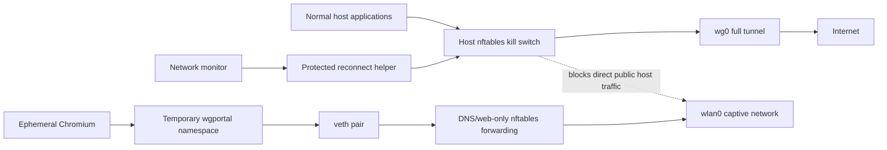

# wireguard-reconnect

Event-driven WireGuard recovery for a Linux laptop using iwd/systemd-networkd,
with Waybar controls, a full-tunnel kill switch, and optional Tailscale route repair.

Current release: **v1.3.0-beta.1**

> **Public beta:** this is an opinionated security integration for a tested
> systemd/Wayland laptop stack, not a distribution-neutral VPN manager. Read the
> support matrix and recovery instructions before installing it on another
> machine.

Licensed under **GPL-3.0-or-later**.

## Behavior

- **Before normal networking at boot:** pre-arms a fail-closed nftables guard
  using a root-only cached WireGuard endpoint.
- **On every system boot:** marks `wg0` as intended-on and connects it as soon as
  a physical default route is available.
- **After suspend/resume:** restarts the network monitor, waits for Wi-Fi, tests
  real traffic through `wg0`, and reconnects only when stale.
- **After Wi-Fi/AP/network changes:** reacts to netlink route/link/address events
  instead of waiting for Waybar's polling threshold.
- **After an intentional disconnect:** leaves WireGuard off for the rest of that
  boot. The next system boot enables it again by default.
- **With opt-in Tailscale integration:** preserves pre-existing table-52 rules
  and adds a tracked, removable priority rule only when needed to keep active
  tailnet routes ahead of WireGuard, without starting or reconfiguring Tailscale.
- **With the kill switch:** caches the WireGuard endpoint so reconnect can
  bootstrap without leaking general traffic over the physical interface.
- **Fail-closed reconnects:** the nftables guard is armed and verified before
  `wg0` is brought up, remains active while `wg0` is bounced, and is verified
  again afterward. A failed verification takes `wg0` down and leaves public
  traffic blocked.
- **Automatic captive portals without host leaks:** after a Wi-Fi/AP/network
  event, a failed protected reconnect automatically starts detection from a
  dedicated network namespace. Only when independent probes indicate a portal
  does it open an ephemeral Chromium profile inside that namespace and allow its
  DNS/web traffic over the Wi-Fi underlay. Every normal host process remains
  blocked by the kill switch. After login returns the expected HTTP 204s, the
  namespace is destroyed and WireGuard is restored and verified automatically.

## Architecture



The portal browser receives a separate network stack, routes, and interfaces,
but not a separate filesystem or kernel. Namespace cleanup is verified before
normal VPN actions resume.

## Tested support matrix

| Component | Tested/supported | Notes |
|---|---|---|
| Init/service manager | systemd | Required by installer and sleep hook |
| Firewall | nftables | iptables-only systems are not supported |
| WireGuard | `wg-quick`, full-tunnel `wg0` | Interface may be overridden |
| Wi-Fi/network stack | IPv4 underlay with iwd + systemd-networkd | Other netlink-compatible stacks and IPv6-only underlays are untested |
| Desktop | Wayland + Waybar | CLI controls work without Waybar; automatic browser launch requires an active local Wayland session |
| Browser | Chromium, Brave, or Google Chrome | Firefox is not currently supported by portal isolation |
| Distribution | Arch Linux / Omarchy | Other systemd distributions require dependency/path validation |
| Tailscale | Optional, explicit opt-in | Existing rules are preserved; a tracked rule is added only when required |

Required commands include `systemctl`, `loginctl`, `ip`, `iw`, `wg`, `wg-quick`,
`curl`, `flock`, `nft`, `pkexec`, and `runuser`.

## Files

- `wireguard-reconnect` — root-owned, fixed-action helper used through `pkexec`
- `wireguard-portal` — isolated captive-portal namespace/browser orchestrator
- `wg-killswitch` — nftables full-tunnel kill switch
- `wireguard-status` — Waybar JSON status/toggle/autoreconnect command
- `wireguard-monitor` — event-driven physical-network monitor
- `wireguard-autostart` — enables WireGuard by default on each boot
- `wireguard-reconnect-sleep` — restarts the monitor after resume
- `wireguard-monitor.service` — persistent network monitor
- `wireguard-autostart.service` — boot-time default-on policy
- `wireguard-killswitch.service` — early-boot fail-closed nftables guard

## Install

> Installing changes root-owned nftables policy and can intentionally block
> public traffic when WireGuard cannot be verified. Keep a local root terminal
> available for the first installation, review `make reset`, and do not install
> remotely unless you have an independent recovery path.

Confirm that `/etc/wireguard/wg0.conf` already works with `wg-quick` and includes
`PersistentKeepalive = 25` for roaming laptops. Then run from this repository:

```bash
sudo ./install.sh
```

Install-time options are explicit and root-persisted:

```bash
sudo INSTALL_INTERFACE=wg1 ./install.sh
sudo ENABLE_TAILSCALE_INTEGRATION=1 ./install.sh
```

The default authorized interface is `wg0`; the passwordless helper rejects all
other `wgN` profiles so their root-owned `wg-quick` hooks cannot be triggered.
Tailscale integration is disabled by default and never runs `tailscale up`.
Re-running the installer with integration disabled removes only the tracked rule
previously added by this project.

### Tailscale integration and bypass scope

There are two distinct Tailscale behaviors:

1. **Transport exceptions are always present in the kill switch.** Traffic that
   already leaves through `tailscale0`, and Tailscale's encrypted underlay
   sockets carrying its Linux packet mark, are allowed so `tailscaled` can keep
   its peer tunnels alive while ordinary public traffic remains blocked. The
   tailnet IPv4 range `100.64.0.0/10` and IPv6 range
   `fd7a:115c:a1e0::/48` are also within the documented private/tailnet
   destination exceptions. These exceptions do not start Tailscale or change
   its preferences.
2. **Policy-rule repair is explicit opt-in.** With
   `ENABLE_TAILSCALE_INTEGRATION=1`, the installer records the choice and the
   reconnect helper first verifies that `tailscaled` is healthy and table 52
   has an active `tailscale0` route. If WireGuard's full-tunnel rules would win
   first, it adds a root-owned, tracked destination rule for the tailnet ranges
   immediately ahead of them. Existing policy rules are never deleted or
   rewritten.

Enable or disable policy-rule repair by re-running the transactional installer:

```bash
sudo ENABLE_TAILSCALE_INTEGRATION=1 ./install.sh  # enable
sudo ENABLE_TAILSCALE_INTEGRATION=0 ./install.sh  # disable and remove its tracked rule
```

The integration deliberately does **not** run `tailscale up`, change DNS or
`--accept-routes`, advertise routes, or select/configure an exit node. Configure
those behaviors with Tailscale itself. Existing exit-node policy is outside the
tested integration and may have additional ordering requirements; this project
only manages destination rules for already-active tailnet routes alongside the
WireGuard full tunnel.

Relevant state and verification commands are:

```bash
sudo cat /etc/wireguard-reconnect/tailscale-enabled
sudo cat /run/wireguard-reconnect.tailscale-rules 2>/dev/null || true
sudo tailscale status
ip -4 route show table 52
ip -6 route show table 52
ip -4 rule show | grep -E '100\.64\.0\.0/10|lookup 51820'
ip -6 rule show | grep -E 'fd7a:115c:a1e0::/48|lookup 51820'
```

An absent runtime state file is normal when an adequate pre-existing Tailscale
rule already precedes WireGuard: no project-owned rule is needed. On disable,
uninstall, or failed-install rollback, only a rule recorded in that root-only
state file is removed or restored.

The same kill-switch exception principle applies to loopback, DHCP,
LAN/private destinations, local Docker/bridge interfaces, and the configured
WireGuard UDP endpoint. These are narrow reachability exceptions, not a promise
of isolation from hostile services reachable on those networks; see
[Kill-switch exceptions](#kill-switch-exceptions).

### What the installer changes

The installer:

1. installs root helpers under `/usr/local/bin`;
2. installs `wireguard-status` into the invoking user's `~/.local/bin`;
3. records that desktop user's UID in the root-only automatic-portal identity
   file and installs a narrow polkit rule allowing the local active user to
   invoke only `/usr/local/bin/wireguard-reconnect` without a password;
4. pre-arms and verifies the kill switch, persisting only the endpoint metadata
   needed for the next early boot;
5. performs a protected selected-interface transition and records enough prior
   link state to reverse it if a later verification fails;
6. installs and enables the kill-switch, monitor, and startup services;
7. installs the system-sleep hook;
8. records the authorized interface and optional Tailscale flag in root-only
   configuration; and
9. runs immediate protected traffic, guard, and service checks.

The transaction holds exclusive install, reconnect, and portal locks while
helpers and firewall state are changing. A fresh install arms a 90-second
recovery timer that removes its newly introduced guard if confirmation never
arrives. An upgrade instead uses that timeout to re-arm the validated prior
interface, never to remove a pre-existing guard. Before committing, the
installer confirms the timer and then re-verifies the nftables table, selected
route, real HTTP traffic through WireGuard, and all services.

On failure, rollback removes only an interface created by that attempt, restores
a previously active managed interface, replaces backed-up helpers/configuration,
restores any project-tracked Tailscale rule, and preserves or re-arms the prior
guard. If nftables cannot be queried or guard deletion cannot be verified, it
retains the recovery helpers and refuses destructive cleanup instead of
claiming success.

Installer backups are written under `/var/backups/wireguard-reconnect-*` and are
never restored or deleted automatically.

### Uninstall

Uninstalling intentionally disconnects WireGuard and removes the kill switch
before deleting helpers and services. WireGuard configuration and installer
backups are left untouched. A specific backup is restored only when explicitly
requested with `RESTORE_BACKUP_DIR=/var/backups/wireguard-reconnect-...`:

```bash
make uninstall
# or: sudo ./uninstall.sh
```

Uninstall refuses to proceed while portal cleanup is active or if it cannot
safely remove the fail-closed guard.

The Waybar module should execute `wireguard-status` and bind only middle-click
to `wireguard-status toggle`. Leaving left- and right-click unbound prevents an
accidental connect or disconnect:

## Make commands

Run `make` or `make help` in this repository to list the available controls.
The common commands mirror the Waybar icon and provide an explicit recovery
path:

```jsonc
"custom/wireguard": {
  "exec": "wireguard-status",
  "return-type": "json",
  "interval": 10,
  "signal": 10,
  "on-click-middle": "wireguard-status toggle"
}
```

```bash
make status       # show the icon's current state
make toggle       # same as middle-clicking the icon
make disconnect   # explicit intentional disconnect
make connect      # explicitly connect wg0
make reconnect    # explicitly bounce and reconnect wg0
make reset        # EMERGENCY full bypass; disables leak protection
```

### Captive portals

The installed network monitor normally starts portal mode automatically after a
new Wi-Fi connection or AP change when a protected WireGuard reconnect still
cannot pass traffic. It identifies the active desktop user from the root-owned
`/etc/wireguard-reconnect/portal-user` file written by the installer, verifies
that user owns the active local graphical session, and launches the isolated
browser only when both probes return concrete portal-like HTTP responses
(non-204 2xx/3xx or status 511). DNS errors, timeouts, server errors, or one
blocked check endpoint are treated as inconclusive and never open a browser. Repeat attempts on the same BSSID are
rate-limited for five minutes; a different AP bypasses that per-AP cooldown
after a short 30-second global anti-popup interval. A periodic guarded health
check also catches portals connected before the Wayland session was available.

If Wi-Fi disconnects, the default route/BSSID changes, or the selected desktop
session becomes inactive or remote during login, the transaction cancels, tears
down its isolated path, and returns fail-closed. The next network event evaluates
the new AP and active local session.

Manual fallback remains one command:

```bash
make portal
```

Automatic and manual modes perform the same transaction:

1. acquires a portal lock honored by every connect, disconnect, and reconnect
   action, then verifies the host-wide fail-closed nftables guard;
2. takes `wg0` down without removing that guard;
3. creates a root-owned network namespace and veth pair, enabling and recording
   only the two required per-interface forwarding knobs without changing the
   host's global IPv4 router mode; when the physical interface was already
   forwarding, existing Docker/libvirt/Tailscale routed flows are preserved;
4. permits only DNS, HTTP, HTTPS, and QUIC from that namespace and rejects
   namespace-originated access to services on the host itself;
5. probes independent Google and Cloudflare plain-HTTP 204 endpoints so one
   allow-listed detector cannot create a false "open internet" result;
6. when interception is detected, opens an isolated Chromium-family browser
   with a new temporary profile inside the namespace;
7. polls until the connectivity endpoint returns HTTP 204;
8. resolves the WireGuard endpoint from the authenticated isolated namespace
   and stages it as a runtime-only candidate so protected bootstrap does not
   depend on still-blocked host DNS; the persistent cache is updated only after
   real traffic through WireGuard is verified;
9. closes the browser and verifies destruction of its profile, namespace, NAT
   table, and veth before clearing portal state, restoring the two prior
   per-interface forwarding settings, or permitting any other VPN action;
10. reconnects WireGuard and verifies both the selected `wgN` route and real HTTP traffic.

The same trust rule applies outside portal mode: newly resolved endpoint DNS can
be used only as a runtime pre-arm candidate and is persisted only after an HTTP
request succeeds through `wg0`. The independent kill-switch watchdog continues
checking nftables every 15 seconds even while portal authentication is waiting.
External periodic connectivity checks run separately every 60 seconds by
default; netlink network events still trigger immediate recovery.

No regular host process receives direct underlay access. The browser has no
normal profile, cookies, extensions, password manager, or sync state. Closing
it early, pressing Ctrl-C, timing out, or encountering an error triggers cleanup
and an attempted protected reconnect; if reconnect fails, the host remains
fail-closed.

A known starting domain is optional:

```bash
make portal DOMAIN=wifi.example.com
make portal DOMAIN=http://wifi.example.com/login
```

This only chooses the isolated browser's starting page; it does not create a
host-wide domain exception.

A no-root local simulation is included:

```bash
make portal-simulate
```

A Docker-backed variant runs the fake portal in an isolated container bound only
to a random loopback port, exercises the same detector state machine, removes
the container and its locally tagged test image, and runs the rootless kernel
namespace/firewall test:

```bash
make portal-container-simulate
```

The regular simulator starts a loopback HTTP server that initially redirects like a
captive portal, accepts a simulated login, then changes the detector response to
204. It also uses an unprivileged throwaway user/network namespace (when the
kernel permits one) to prove that portal HTTP succeeds while a non-web port and
a service on the host-side veth remain blocked. It never touches live
WireGuard, the host nftables ruleset, or the real network interfaces.

Troubleshooting and maintenance commands are also available:

```bash
make diagnostics
make logs
make test
make install      # sudo install/update of the system integration
make uninstall    # safe removal; preserves WireGuard configs/backups
```

`make reset` remains an emergency full bypass for repairing a broken ruleset.
It is not used by captive-portal mode and intentionally removes leak protection;
prefer `make portal` whenever the network requires browser authentication.

Check the installed version with:

```bash
wireguard-reconnect --version
```

## Versioning and releases

The project follows [Semantic Versioning](https://semver.org/):

- **MAJOR** for incompatible behavior or installation changes
- **MINOR** for backward-compatible features
- **PATCH** for backward-compatible fixes

`VERSION` is the source of truth for the current release. Release commits are
tagged as `vMAJOR.MINOR.PATCH`, and notable changes are recorded in
[`CHANGELOG.md`](CHANGELOG.md).

Release checklist:

1. update `VERSION`;
2. move release notes into `CHANGELOG.md` with the release date;
3. update the current release shown in this README;
4. run the test and static-validation commands;
5. commit, create an annotated release tag, and push the commit and tag to both
   GitHub and FGit;
6. publish matching GitHub release notes; and
7. verify the public CI workflow.

## Configuration overrides

Environment variables may be supplied through systemd service drop-ins:

The authorized interface and Tailscale integration are install-time settings;
re-run the installer to change them. Runtime service drop-ins may adjust:

- `WIREGUARD_MONITOR_DEBOUNCE=5`
- `WIREGUARD_MONITOR_STABILIZE_DELAY=2`
- `WIREGUARD_AUTO_PORTAL=1`
- `WIREGUARD_PORTAL_COOLDOWN=300`
- `WIREGUARD_PORTAL_GLOBAL_COOLDOWN=30`
- `WIREGUARD_PORTAL_SCAN_INTERVAL=60`
- `WIREGUARD_PORTAL_USER_FILE=/etc/wireguard-reconnect/portal-user`
- `WIREGUARD_STARTUP_WAIT=30`
- `WIREGUARD_CHECK_URL=http://connectivitycheck.gstatic.com/generate_204`
- `WIREGUARD_CHECK_TIMEOUT=4`
- `WG_KILLSWITCH_LOG_MAX_BYTES=262144`
- `WG_KILLSWITCH_LOG_KEEP_LINES=1000`
- `WIREGUARD_PORTAL_CHECK_URL_PRIMARY=http://connectivitycheck.gstatic.com/generate_204`
- `WIREGUARD_PORTAL_CHECK_URL_SECONDARY=http://cp.cloudflare.com/generate_204`

## Performance and network checks

The nftables watchdog performs local rule verification every 15 seconds. A
separate portal/recovery scan performs an external HTTP connectivity check at
most once every 60 seconds while VPN intent and a physical route are present.
Netlink route/link events remain immediate. Waybar's own `interval` controls how
often `wireguard-status` performs its user-visible connectivity check.

Connectivity checks contact Google's and Cloudflare's standard HTTP-204
endpoints. The project has no analytics, telemetry collector, or project-owned
server, but those providers can observe normal request metadata such as source
address and timestamp.

## Diagnostics

The consolidated first check is:

```bash
make logs
```

It includes the current monitor process metadata, the last 400 relevant journal
entries, and bounded runtime helper logs. This is raw diagnostic output and may
contain addresses, routes, interfaces, or local paths; redact it before sharing.
For a reduced summary, use `make support-info`. More targeted commands are:

```bash
systemctl status wireguard-killswitch.service wireguard-monitor.service wireguard-autostart.service
journalctl -u wireguard-killswitch.service -u wireguard-monitor.service -u wireguard-autostart.service -b
journalctl -t wg-killswitch -t wireguard-reconnect -t wireguard-monitor -t wireguard-portal -b
wireguard-status
```

The latest privileged helper output is written to
`/run/wireguard-reconnect.log`. Critical fail-closed state is also written to
`/run/wireguard-reconnect.failure` and shown in the Waybar tooltip. Captive
portal activity is written to `/run/wireguard-portal.log`, with active
transaction metadata in `/run/wireguard-portal.active`.

Log cleanup is automatic. Journald rotates and vacuums its own persistent or
volatile journal according to the host's `systemd-journald` limits. All `/run`
files disappear on reboot; during long uptimes the reconnect log is replaced on
each action, the portal log is replaced on each transaction, and the only
append-style helper log (`/run/wg-killswitch.log`) is locked and trimmed at 256
KiB to its newest 1000 lines. These limits are configurable with the variables
listed above.

Run the unprivileged nftables-generation regression test with:

```bash
./tests/test-killswitch.sh
./tests/test-autostart.sh
./tests/test-status.sh
./tests/test-make-controls.sh
./tests/test-portal.sh
./tests/test-portal-netns.sh  # also run by the portal simulator when supported
./tests/test-auto-portal.sh
./tests/simulate-captive-portal-container.sh  # optional; requires Docker
./tests/test-version.sh
```

The autostart test verifies that startup is idempotent when another boot
component has already created `wg0`. The version test ensures `VERSION`,
`CHANGELOG.md`, the README release label, and `wireguard-reconnect --version`
remain consistent. The kill-switch test
verifies policy-drop output/forward chains, the endpoint-only public
exception, unresolved-endpoint behavior, and fallback to a smaller emergency
guard when the full nftables ruleset is rejected. Failure cases leave a
blocking guard installed while returning non-zero so WireGuard stays down.

## Kill-switch exceptions

When enabled, public IPv4 and IPv6 egress is rejected unless it uses `wg0`.
Explicit host exceptions are limited to loopback, LAN/private destinations,
DHCP, the configured WireGuard UDP endpoint, Tailscale's marked encrypted
underlay, `tailscale0`, and local Docker/bridge interfaces. During captive-portal
mode, forwarded traffic from the root-created `wgportal0` veth is additionally
limited to DNS and web ports; all other traffic from that namespace is rejected
before the normal private/LAN forwarding exception. An intentional emergency
**disconnect/reset** still removes the guard completely; the next system boot
restores the default-on guarded policy. Because LAN/private, Tailscale, DHCP,
and local bridge exceptions are intentional, the kill switch is not isolation
from hostile devices or proxies reachable through those permitted local paths.

## Security and contributing

Read [`SECURITY.md`](SECURITY.md) before reporting a suspected leak or privilege
boundary issue. General contributions follow [`CONTRIBUTING.md`](CONTRIBUTING.md)
and the [`CODE_OF_CONDUCT.md`](CODE_OF_CONDUCT.md).

## License

Copyright contributors to wireguard-reconnect.

This project is free software licensed under the GNU General Public License,
version 3 or any later version (`GPL-3.0-or-later`). See [`LICENSE`](LICENSE).
The project invokes system utilities such as WireGuard, nftables, systemd,
Chromium-family browsers, and optional Tailscale as separate programs; those
programs retain their own licenses.
